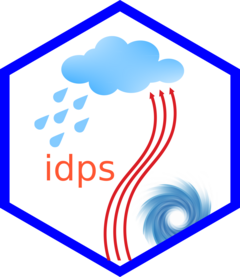

# idps 

<!-- badges: start -->
[](https://lifecycle.r-lib.org/articles/stages.html#experimental)
[](https://github.com/ahmathlete/idps/actions/workflows/R-CMD-check.yaml)
<!-- badges: end -->

The goal of idps is to ...

## Installation

You can install the development version of idps from [GitHub](https://github.com/) with:

``` r
# install.packages("devtools")
devtools::install_github("ahmathlete/idps")
```

## Example

This is a basic example which shows you how to solve a common problem:

``` r
library(idps)
## basic example code
```

